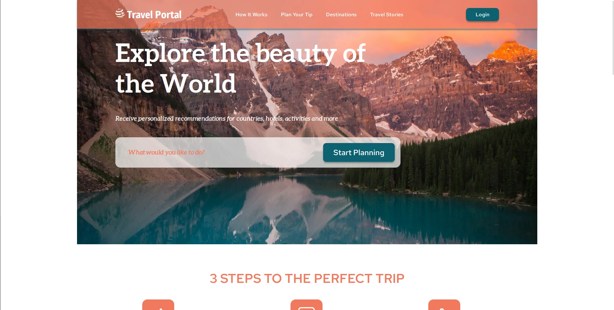
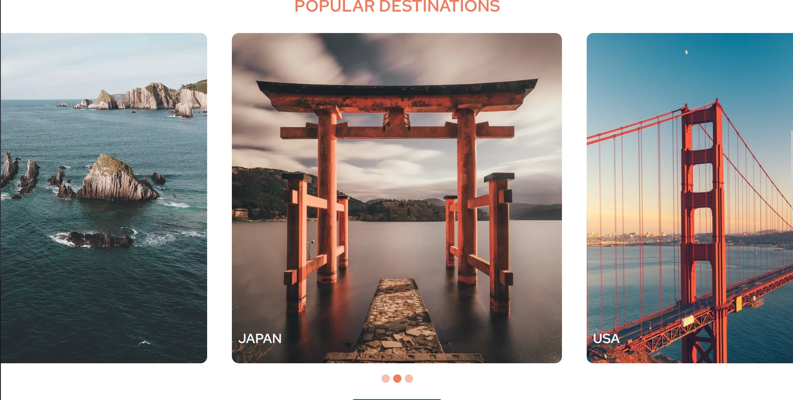
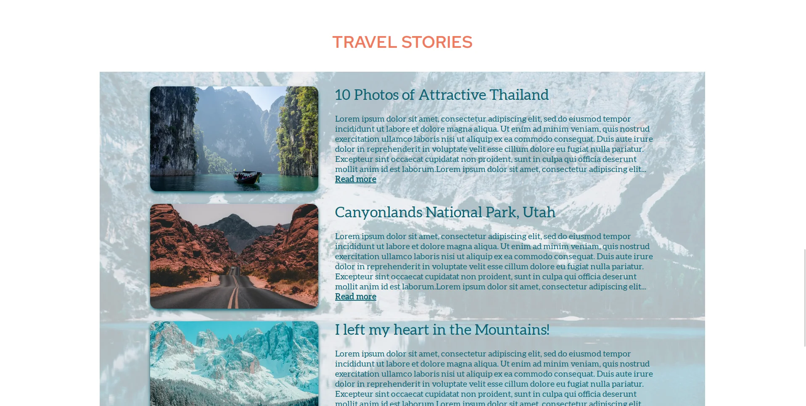
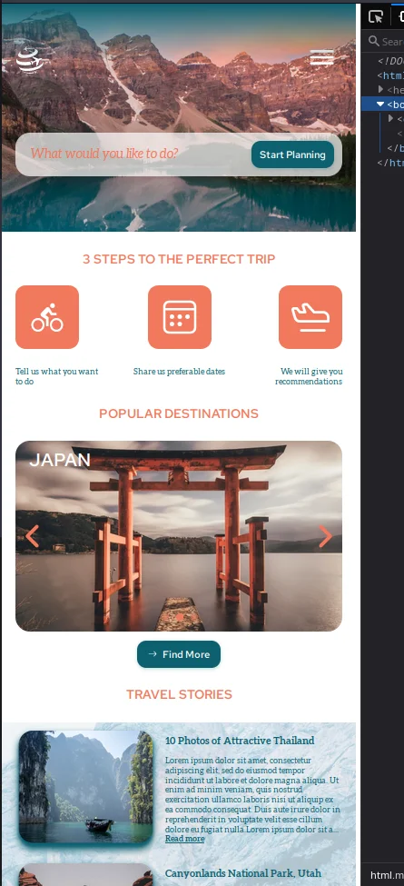

# Test cross-platform landing
Uses my own frontend library for component approach. I was originally intended to recreate Vue to some extent.

*Note: towebp is a script for converting images to webp, with compression*

## Setup
Install **Node.JS v16**, **yarn**.
```sh
git clone https://github.com/Foresteam/weeb.git
cd weeb
yarn -D
yarn dev
```

Reference: https://www.figma.com/file/BhULVGGIachSAjoBazhP9P/Travel?node-id=8%3A15&t=VMxj4HwhDhsQeR2h-0

## The site
### Desktop



### Mobile

